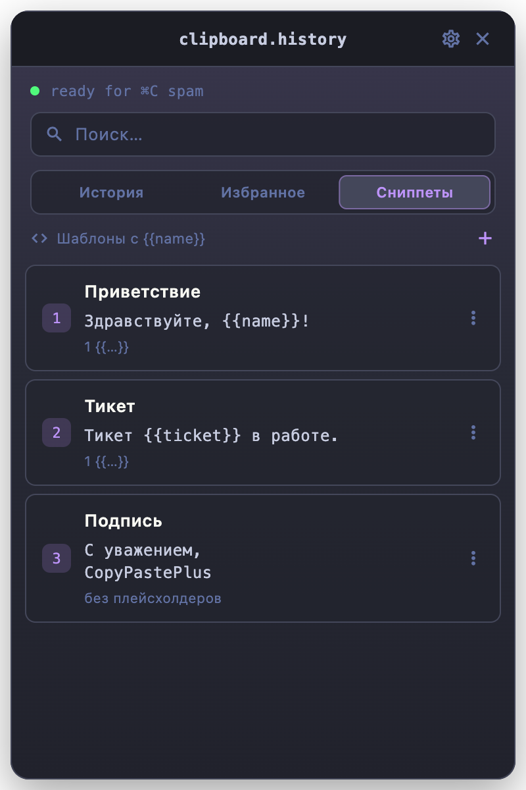
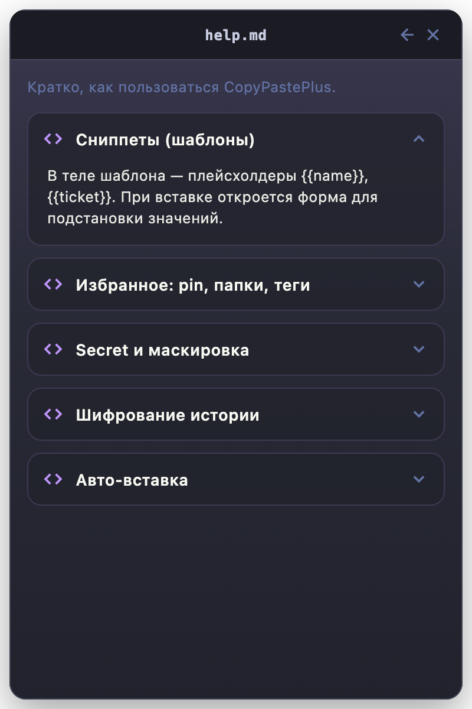

# Documentation & GitHub Pages

Сайт продукта: [fso13.github.io/copy_paste_plus](https://fso13.github.io/copy_paste_plus/)

Актуальная версия приложения: **1.1.4** (см. [CHANGELOG.md](../CHANGELOG.md)).

### Codesign / notarize

Локально или в CI (секреты репозитория):

```bash
export CODESIGN_IDENTITY="Developer ID Application: … (TEAMID)"
export APPLE_TEAM_ID=…
# optional notarization:
export NOTARIZE=1 APPLE_ID=… APPLE_APP_SPECIFIC_PASSWORD=…
./scripts/create_dmg.sh --build
```

Скрипт: [`scripts/codesign_and_notarize.sh`](../scripts/codesign_and_notarize.sh).

Статика в корне `docs/`:

| Файл | Назначение |
| --- | --- |
| `index.html` | Лендинг |
| `styles.css` | Стили (Dracula / light, как fso13) |
| `script.js` | Тема, reveal, glitch, пасхалка, changelog |
| `CHANGELOG.md` | Копия корневого журнала |
| `changelog-data.js` | Встроенный markdown для секции Changelog (без fetch) |
| `screenshots/` | Скриншоты продукта |

Changelog на сайте читается из встроенного `changelog-data.js` (и запасной `CHANGELOG.md`). При изменении корневого `CHANGELOG.md` запустите:

```bash
./scripts/sync_pages_changelog.sh
```

## Включение Pages

В репозитории: **Settings → Pages → Build and deployment**

- Source: **Deploy from a branch**
- Branch: `main` (или `master`), folder: `/docs`

После пуша сайт появится по адресу `https://fso13.github.io/copy_paste_plus/`.

Локальный просмотр:

```bash
cd docs && python3 -m http.server 8080
# http://localhost:8080
```

## Screenshots

### History


### Favorites


### Snippets



### Settings


### Help



### App icon

<p align="center">
  
</p>

## Regenerating screenshots

Widget-test capture often hangs on macOS (`toImage`). Use the real-engine tool
(the sandboxed app writes into its container; copy into the repo afterwards):

```bash
flutter run -t tool/generate_docs_screenshots.dart -d macos
cp -f ~/Library/Containers/com.fso13.copyPastePlus/Data/docs/screenshots/*.png \
  docs/screenshots/
```

Demos live in `tool/docs_screenshot_demos.dart`.

## Related

- [CONTRIBUTING.md](../CONTRIBUTING.md)
- [CHANGELOG.md](../CHANGELOG.md)
- [README.md](../README.md)
