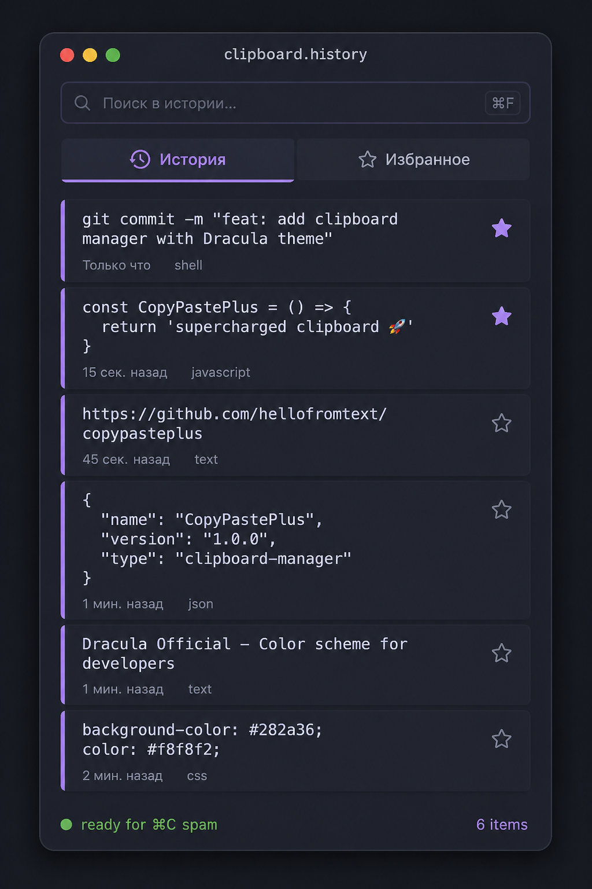
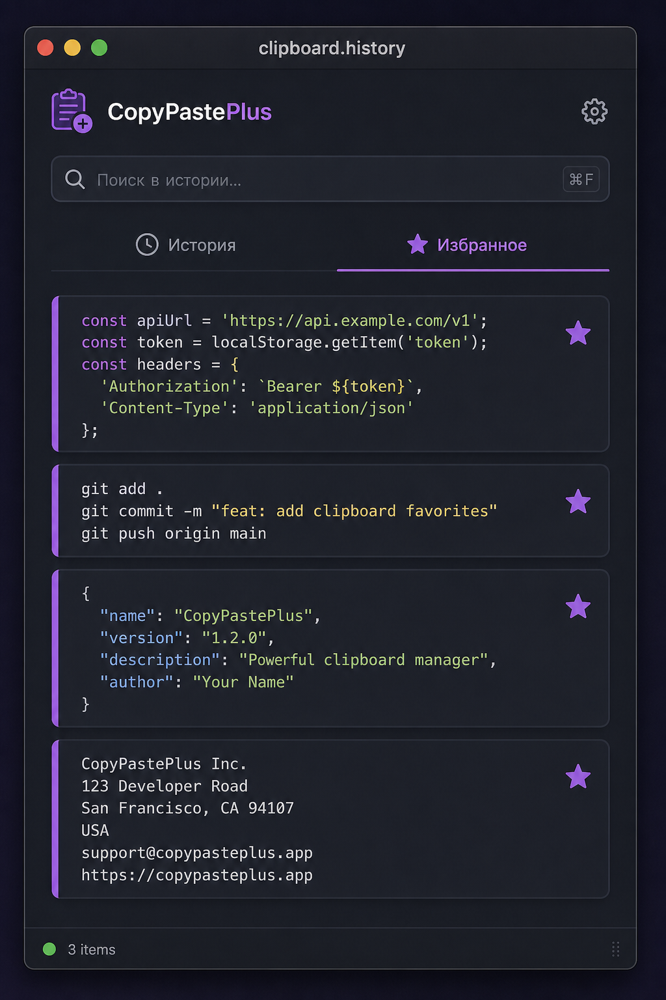
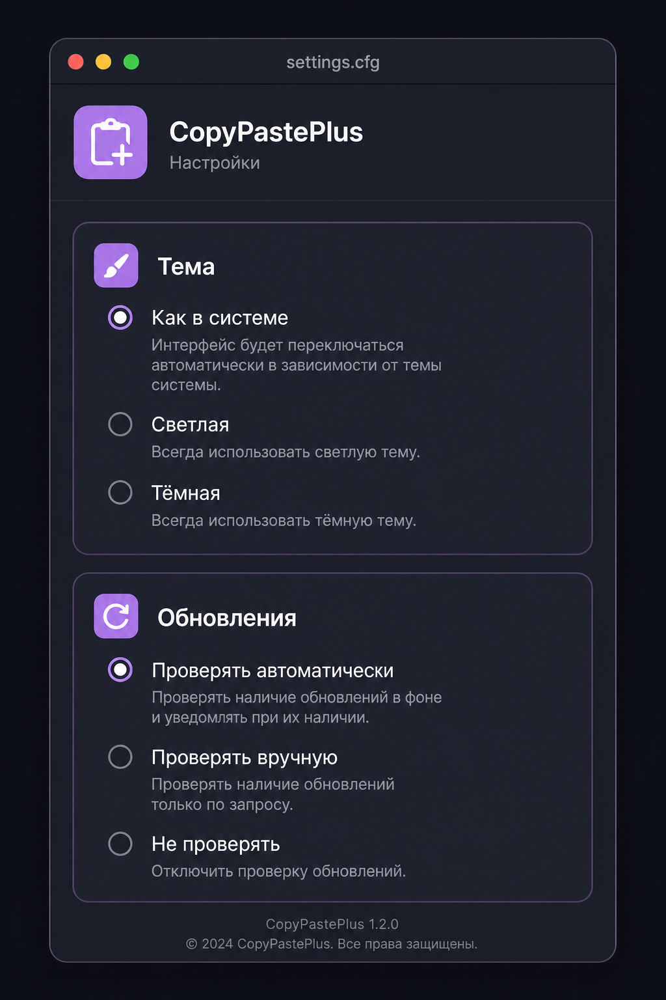

# Documentation & GitHub Pages

Сайт продукта: [fso13.github.io/copy_paste_plus](https://fso13.github.io/copy_paste_plus/)

Статика в корне `docs/`:

| Файл | Назначение |
| --- | --- |
| `index.html` | Лендинг |
| `styles.css` | Стили (Dracula / light, как fso13) |
| `script.js` | Тема, reveal, glitch, пасхалка |
| `screenshots/` | Скриншоты продукта |

## Включение Pages

В репозитории: **Settings → Pages → Build and deployment**

- Source: **Deploy from a branch**
- Branch: `main` (или `master`), folder: `/docs`

После пуша сайт появится по адресу `https://fso13.github.io/copy_paste_plus/`.

Локальный просмотр:

```bash
cd docs && python3 -m http.server 8080
# http://localhost:8080
```

## Screenshots

### History



### Favorites



### Settings



### App icon

<p align="center">
  
</p>

## Regenerating screenshots

```bash
flutter test test/docs_screenshot_test.dart
```

## Related

- [CONTRIBUTING.md](../CONTRIBUTING.md)
- [CHANGELOG.md](../CHANGELOG.md)
- [README.md](../README.md)
